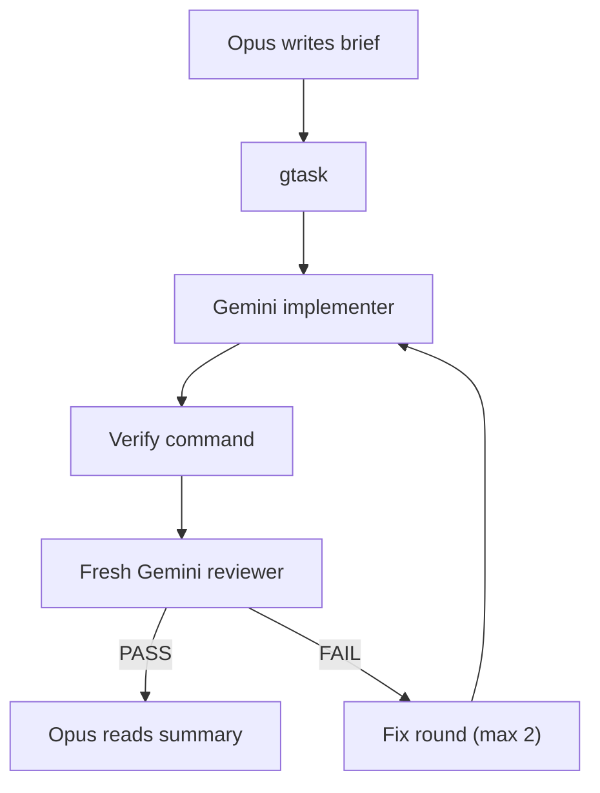
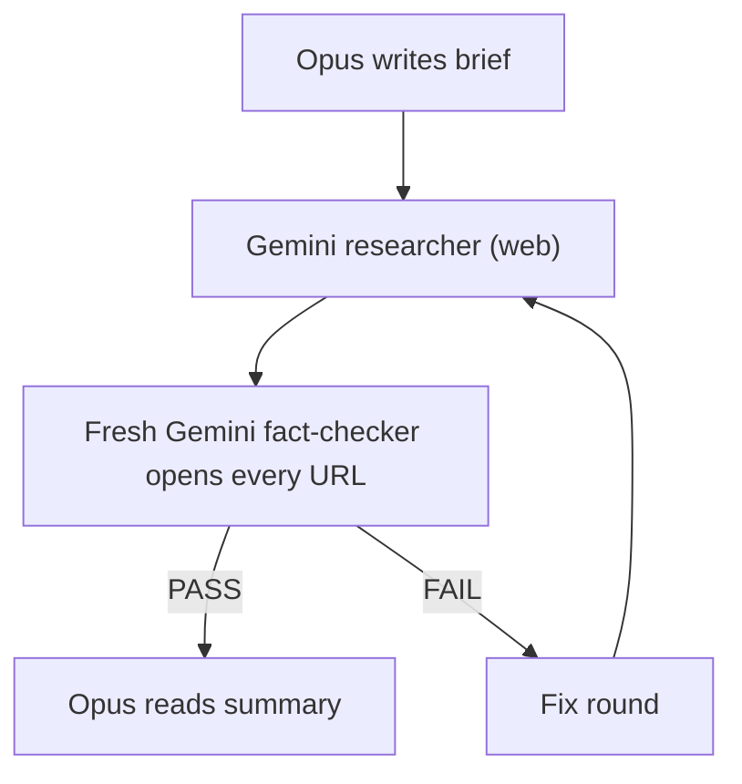

# opus-gemini-orchestrator

Claude Opus plans and verifies, Gemini (Antigravity CLI) writes the code, tests, reviews and research, to spend less Claude usage without lowering quality.

[](https://github.com/tahmidulferdous/opus-gemini-orchestrator/actions/workflows/ci.yml)
[](LICENSE)
[](https://skills.sh)

## Why

Claude usage is limited and costly; many developers also have Gemini quota through Antigravity. Opus is best spent on planning and judgement; volume work can go to Gemini. Quality is protected by gates (precise briefs, tests that must pass, an independent Gemini reviewer or fact-checker, bounded fix loops), not by Opus re-reading everything.

## How it works

### Implementation loop (opus-gemini-full)



### Research loop (gresearch)



## Modes

| Command | Opus does | Gemini does | Claude usage |
|---------|-----------|-------------|--------------|
| `/opus-gemini-lite` | plan, step-level instructions, reviews every diff, runs all checks | follows instructions: code and tests | highest |
| `/opus-gemini-mid` | plan, task instructions, reads logic-bearing diffs, runs verify | code and tests in parallel workers, runs them, fixes feedback | medium |
| `/opus-gemini-full` | plan, task briefs, reads verdicts and test results | implements, tests, independent review, fix loop (`gtask`) | lowest |
| `/opus-gemini-deepresearch` | research brief, reads summary, rules on gaps | web research, cited report, citation fact-check, fixes (`gresearch`) | lowest |
| `/opus-sonnet` | plan, instructs, reviews | Sonnet subagents do the work (no Gemini) | Claude only |
| `/opus-solo` | everything | nothing | Claude only |

Switching works by running a slash command that writes the selection to `~/.claude/exec-mode`; a `UserPromptSubmit` hook injects the current mode into every prompt, persisting across sessions.

## Requirements

- Claude Code
- Antigravity CLI `agy` installed and signed in (https://antigravity.google/docs/cli/install/)
- jq, sqlite3, python3, git
- Linux or macOS with bash

Note: tested on Linux with agy 1.2.5.

## Install

```bash
npx skills add tahmidulferdous/opus-gemini-orchestrator -a claude-code -g
bash ~/.claude/skills/opus-gemini-orchestrator/scripts/install.sh --agy-permissions
```

Then:
1. Add `read_file(<root>/)` and `write_file(<root>/)` rules for your project folders to `~/.gemini/antigravity-cli/settings.json`.
2. Restart Claude Code.
3. Run `/opus-gemini-full`.

### Manual alternative

Clone the repository and run `install.sh` directly from the clone to link the skills into `~/.claude/skills`:

```bash
git clone https://github.com/tahmidulferdous/opus-gemini-orchestrator.git
cd opus-gemini-orchestrator
bash skills/opus-gemini-orchestrator/scripts/install.sh --agy-permissions
```

### Uninstall

```bash
bash ~/.claude/skills/opus-gemini-orchestrator/scripts/install.sh --uninstall
```

## Usage

### Example prompts by mode

- `/opus-gemini-full`: "Add CSV export to the reports page with tests"
- `/opus-gemini-mid`: "Refactor authentication middleware to support token refresh"
- `/opus-gemini-lite`: "Update the database connection timeout in config.py from 5s to 10s and update tests"
- `/opus-gemini-deepresearch`: "Research SQLite vector search extensions available in 2026 and compare performance"
- `/opus-sonnet`: "Audit the parser module for memory leaks"
- `/opus-solo`: "Explain the architecture of the orchestrator hook"

### Tools

| Command | What it does | Prints |
|---------|--------------|--------|
| `gdo "task"` | one Gemini call with the executor contract, workspace = current dir | `STATUS`/`FILES`/`VERIFY`/`NOTES`, `git status` |
| `gdo -c <id> "msg"` | continue the same Gemini conversation (feedback, answers) | same |
| `gdo -l` | this folder's agy conversations (headless `/resume`) | id, title, steps, time |
| `gtask <brief.md>` | implement, run `Verify:`, fresh-Gemini review, up to 2 fix rounds | verdict, test tail, diff stat, Critical/Important findings |
| `gresearch <brief.md>` | research with web tools, fresh-Gemini fact-check of every URL, up to 2 fix rounds | verdict, source count, unsupported claims, executive summary |

### Environment variables

- `GDO_MODEL`: default `gemini-3.8-flash-high` (use `gemini-3.1-pro-high` for tasks requiring deeper reasoning)
- `GDO_EFFORT`: default `high`
- `GDO_TIMEOUT`: default `20m`
- `GTASK_ROUNDS`: default `2`
- `GRESEARCH_ROUNDS`: default `2`

## Example run

```
gtask task-speed: PASS rounds=0 tests_exit=0 implementer=beea2918-ceb1-4662-a225-7db58d071c43
 main.js  | 19 +++++++++++++++----
 snake.js |  6 +++++-
 test.cjs | 20 ++++++++++++++++++++
 3 files changed, 40 insertions(+), 5 deletions(-)
tests (tail):
ok - 13) tickMs(100) === 60

# tests 13
# pass  13
# fail  0
```

Opus read only these lines, not the code.

## Permissions and safety

Headless `agy` cannot prompt for user approval. When an action is unapproved, `agy` soft-denies the tool call but still exits 0 with `status: SUCCESS` and an empty response. The scripts inspect `denied_actions` and stderr, and exit non-zero so failures are never hidden.

Permissions are configured in `~/.gemini/antigravity-cli/settings.json` under `allow`, `deny`, and `ask` lists (deny > ask > allow precedence).

Compound shell commands are denied even when each individual command is allowlisted (for example, commands joined by `&&`, `;`, `|`, or `>` redirects). Prompts instruct workers to run one simple command per tool call and use file tools for writing files.

The flag `--dangerously-skip-permissions` is never used.

### Security note on web tools

Headless research uses `search_web` and `read_url_content`. The `read_url(*)` rule allows reading web pages, but fetched pages can contain prompt injection, and URLs can leak sensitive data in query strings. Keep `execute_url` unallowed, and restrict `read_file` and `write_file` rules to project roots.

## Troubleshooting

- `DENIED:` lines: Add the named permission rule to `~/.gemini/antigravity-cli/settings.json`, or let the retry attempt steer around the restriction.
- Gemini cannot see the project: The workspace directory is passed via `--add-dir "$PWD"`; ensure commands are run from the project root.
- Quota: Check Gemini quota limits using `agy -p "/usage"`.
- `agy` missing: If Antigravity CLI is not installed or signed in, switch to Claude-only execution with `/opus-sonnet`.

## Limitations

- Gemini output quality varies depending on the task.
- The tools are bash scripts tested on Linux.
- Antigravity CLI behaviour can change between versions.
- The Gemini session inside the VS Code Antigravity extension is separate and not driven by these tools.

## Contributing

See [CONTRIBUTING.md](CONTRIBUTING.md) for testing instructions and contribution guidelines.

## Support

If this saves you Claude usage, a GitHub star helps others find it.

## Disclaimer

Not affiliated with Anthropic or Google; Claude, Gemini and Antigravity are trademarks of their owners.

## License

MIT License. See [LICENSE](LICENSE) for details.
